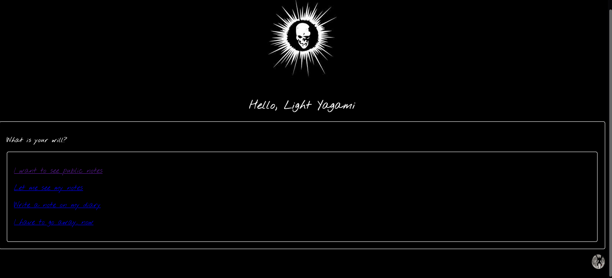
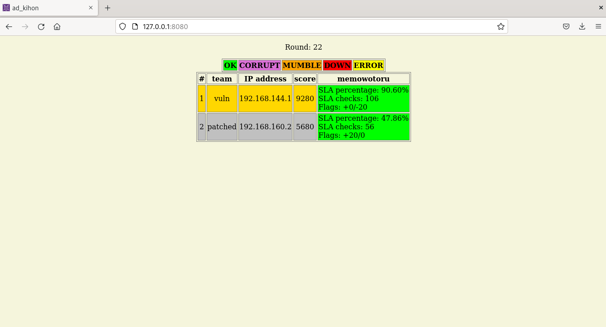

# memowotoru



This is an attack-defense-CTF-like training exercise; there is:

- a dockerized vulnerable service, which is ```memowotoru```;
- the patched service, which is ```memowotoru_patched``` (in the folder there is also a writeup which discusses the vulnerabilities & weaknesses of the service);
- the exploit scripts, in ```exploits``` folder;
- a checker for the service, in the ```checker``` folder, developed using [checklib](https://github.com/pomo-mondreganto/checklib).

The idea was to use [this](https://github.com/pomo-mondreganto/ForcAD) gameserver, but it had many issues, so we made a more modest arrangement and left here the checker for reference to write an equivalent checker for another platform. <br>
In fact, we developed another platform: [this one](https://github.com/Shotokhan/ad_kihon). <br>



To deploy the platform, there is ```gameserver.yml```; to deploy the entire game, with the services, there is the ```Makefile```, with commands ```up``` and ```stop```. <br>
In ```volume``` folder there is the ```config.json``` for the new platform, ```requirements.txt``` for the checker, and ```memowotoru``` subfolder with the actual checker. <br>
You have to change ```config.json``` by modifying start time and end time, and IP addresses of the services, according to your local docker network (or by using container names, if it works). <br>
If you can't reach a service from the gameserver, you can try one of the following 2 solutions:

1. Restart the container with the NET_ADMIN capability, install the package iproute2 and add route using ```ip route add <IP> via <GATEWAY>```;
2. From the host, localize the network of the service you're trying to reach using ```docker network ls```, then the docker id of the gameserver (which must be in running state), and do ```docker network connect <NETWORK> <CONTAINER>```.


